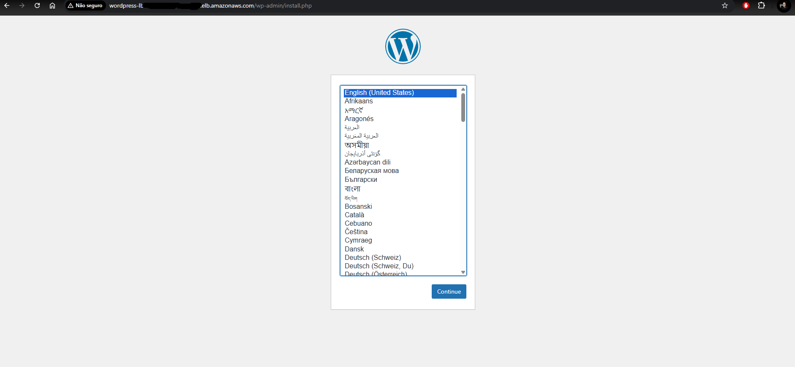

# Wordpress na AWS  

## Este projeto documenta a implantação de uma aplicação WordPress na nuvem da AWS, utilizando uma arquitetura escalável e de alta disponibilidade com contêineres Docker. 

### Visão Geral do Projeto:

### * Arquitetura inicial:

* Usuários acessando a aplicação através de um Load Balancer.

* Uma Virtual Private Cloud (VPC) abrangendo os recursos.
* Duas Zonas de Disponibilidade, cada uma contendo uma instância EC2 executando WordPress com contêineres Docker.
* Um Auto Scaling Group para gerenciar as instâncias EC2.
* Um banco de dados Amazon RDS (MySQL) para a aplicação WordPress.

### * Principais Tarefas e Requisitos:

* Instalação do Docker/Containerd: Instalar e configurar o Docker ou Containerd no host EC2.

* Implantação do WordPress: Implantar uma aplicação WordPress com:
    * Contêiner de aplicação.
    * Banco de dados RDS MySQL.
* Configuração do AWS EFS: Configurar o AWS Elastic File System (EFS) para arquivos estáticos do WordPress.
* Configuração do Load Balancer: Configurar um Load Balancer AWS para a aplicação WordPress.

### Considerações Importantes:

* Sem IP Público para Serviços WP: Evitar o uso de IP público para os serviços WordPress. O tráfego deve sair idealmente pelo Load Balancer (o Classic Load Balancer é sugerido).

* EFS para Arquivos Estáticos: Utilizar EFS para pastas públicas e estáticas do WordPress.
* Método de Dockerização: Você pode escolher usar Dockerfile ou Docker Compose.
* Demonstração: A aplicação WordPress deve ser demonstrada funcionando (tela de login).
* Porta: A aplicação WordPress precisa estar rodando na porta 80 ou 8080.
* Controle de Versão: Usar um repositório Git para versionamento.

### * Arquitetura final:

* ``Rede`` : Uma Virtual Private Cloud (VPC) customizada com sub-redes públicas e privadas distribuídas em duas Zonas de Disponibilidade (AZs). 

* ``Acesso`` : Os usuários acessam a aplicação através de um Application Load Balancer (ALB) que distribui o tráfego para as instâncias. 
* ``Aplicação`` : Um Auto Scaling Group gerencia duas instâncias EC2 em sub-redes privadas. Cada instância executa um contêiner Docker com a aplicação WordPress. 
* ``Banco de Dados``: Um banco de dados Amazon RDS para MySQL, localizado em sub-redes privadas, serve como backend para o WordPress. 
* ``Arquivos Estáticos`` : Um sistema de arquivos compartilhado Amazon EFS é montado nas instâncias para armazenar o conteúdo do wp-content, garantindo consistência entre as instâncias. 

---


# Primeiros passos :
## Configurando a AWS :

### 1. Criando uma VPC

* Fui até ``VPC`` > ``Your VPCs`` > ``Criar VPC`` 

  

Em vez de criar cada componente de rede manualmente, utilizamos o assistente "VPC and more" no console da AWS. Esta abordagem simplificada criou de uma só vez:

* Uma VPC com um bloco CIDR 10.0.0.0/16.
* Duas Zonas de Disponibilidade.
* Duas sub-redes públicas (para o Load Balancer).
* Duas sub-redes privadas (para as instâncias EC2 e o RDS).
* Um Internet Gateway anexado à VPC.
* Um NAT Gateways permitindo que as instâncias nas redes privadas acessem a internet.
* Tabelas de Rotas configuradas para direcionar o tráfego corretamente (sub-redes públicas via Internet Gateway e privadas via NAT Gateway).

Optei por um bloco ``CIDR maior``, como o ``/16`` , pelo fato de ele fornecer 65.536 endereços de IP, já que vou usar uma arquitetura de ``2 AZs`` e sub-redes ``públicas`` e ``privadas``.

### 2. Criando a instância AMAZON RDS(MySQL)

Aqui o primeiro caminho foi ir para ``AURORA AND RDS`` e clicar na barra lateral em ``Grupos de subredes`` e criar um grupo de sub-redes para as redes privadas em seguinda clicar em ``Bancos de Dados``, e em seguida clicar em ``Criar banco de dados`` .


Após isso eu defini um ``nome de usuário mestre`` e ``senha``, em ``Conectividade`` eu selecionei a minha ``VPC``, em grupos de segurança eu adicionei o grupo criado para o RDS(``db-sg``), defini o ``grupo de sub-redes privadas`` , criei o banco de dados e anotei o ``Endpoint`` e a ``Porta`` para adicionar ao script.

### 3. Criando o EFS

Aqui o primeiro passo foi procurar por ``EFS`` e clicar na barra lateral em ``Sistemas de arquivos`` e depois em ``Criar sistema de arquivos``:


Nas opções eu:
  * Escolhi minha ``VPC``
  * Em ``Network access``, eu adicionei os mount targets nas sub-redes privadas de ambas as ``AZ's`` usando o ``efs-sg``(grupo de segurança criado ).

Após isso eu anotei o ``File System ID`` para adicionar ao script.

### 4. Grupos de Segurança (Firewalls)

A comunicação entre os serviços foi controlada através de três Security Groups principais:

* ``wordpress-sg`` (Para as Instâncias EC2):
  * ``Inbound`` : Permite tráfego HTTP (porta 80) e HTTPS (porta 443) de qualquer lugar (0.0.0.0/0) para que os usuários possam acessar o site através do Load Balancer.
* ``db-sg`` (Para o Banco de Dados RDS):
  * ``Inbound`` : Permite tráfego ``MYSQL/Aurora`` (porta 3306) apenas da origem ``wordpress-sg``.
* efs-sg (Para o Sistema de Arquivos EFS):
  * ``Inbound`` : Permite tráfego ``NFS`` (porta 2049) apenas da origem wordpress-sg.

Esta configuração garante que apenas as instâncias da aplicação possam se comunicar com o banco de dados e o sistema de arquivos.

### 5. IAM Role, Launch Template e Script de Inicialização

Para automatizar a criação das instâncias, criamos um Launch Template.
  * ``IAM Role`` : Primeiro, uma Role chamada ``EC2-WordPress-Role`` foi criada com a política ``AmazonSSMManagedInstanceCore`` , uma boa prática para gerenciamento futuro.
  * ``Launch Template`` Aqui o primeiro passo foi pesquisar por ``EC2`` e depois clicar na barra lateral em ``Modelos de execução`` e logo em seguida em ``Criar um modelo de execução``


Lá dentro eu:
  * ``AMI`` : Amazon Linux 2 (Free tier eligible).
  * ``Instance Type`` : t2.micro (Free tier eligible).
  * ``Key Pair`` : Um par de chaves foi criado para acesso emergencial.
  * ``Security Group`` : Associado ao ``wordpress-sg``.
  * ``IAM Role`` : A role ``EC2-WordPress-Role`` foi anexada.
  * ``User Data`` : O script abaixo foi inserido para ser executado na inicialização de cada instância. Este script é o coração da automação.

```Bash
  #!/bin/bash
# Update e instala pacotes necessários
yum update -y
yum install -y docker amazon-efs-utils

# Inicia e habilita o serviço do Docker
systemctl start docker
systemctl enable docker
usermod -a -G docker ec2-user

# Monta o sistema de arquivos EFS
# O ID do EFS foi substituído pelo valor real durante a criação
EFS_ID="fs-xxxxxxxxxxxxxxxxx"
mkdir -p /var/www/html
mount -t efs -o tls $EFS_ID:/ /var/www/html

# Executa o contêiner do WordPress
# As variáveis de ambiente foram substituídas pelos valores reais do RDS
DB_HOST="SEU_ENDPOINT_DO_RDS"
DB_USER="SEU_USUARIO_MASTER"
DB_PASS="SUA_SENHA_MASTER"
DB_NAME="wordpress"

docker run -d \
-e WORDPRESS_DB_HOST=$DB_HOST \
-e WORDPRESS_DB_USER=$DB_USER \
-e WORDPRESS_DB_PASSWORD=$DB_PASS \
-e WORDPRESS_DB_NAME=$DB_NAME \
-p 80:80 \
-v /var/www/html/wp-content:/var/www/html/wp-content \
--name wordpress \
--restart always \
wordpress:latest
```

### 6. Load Balancer e Auto Scaling Group

Os componentes finais foram configurados para garantir a disponibilidade e escalabilidade.
* Target Group (``wordpress-tg``):

  * Um grupo de destino foi criado para as instâncias, monitorando a saúde na porta HTTP:80.
  * Correção de Health Check: A verificação de saúde foi ajustada para aceitar os códigos de sucesso 200,302, pois a tela inicial do WordPress retorna um redirecionamento (302).

* ``Load Balancer`` : Primeiro passo aqui foi ainda no ``EC2`` navegar na aba lateral até ``Load Balancers`` e clicando em ``Criar Load Balancer``.


* Na tela seguinte selecionei a opçao ``Application Load Balancer`` .


* Na tela seguinte usei a opçao ``Voltado para internet`` (internet-facing).
  * Escolhi a minha ``VPC``.
  * Mapiei as ``sub-redes públicas`` em ambas as ``AZ's``
  * Na parte de ``Listeners e roteamento`` eu cliquei na opção ``Criar grupo de destino`` e lá usei essas configurações:
    
  * Após isso eu associei ela a minha ``Instancia`` e configurei o ``Listener`` na porta ``80`` para o ``Target Group`` criado.

* ``Auto Scaling group`` Aqui, novamente em ``EC2`` eu rolei a barra lateral esquerda e cliquei em ``Grupos Auto Scaling`` e logo após em ``Criar grupo do Auto Scaling`` .


* Foi configurado para usar o ``WordPress-Template``.
* Foi posicionado nas sub-redes privadas da VPC.
* Foi anexado ao Target Group ``wordpress-tg``.
* ``Capacidade`` : Configurado com capacidade ``mínima de 2`` , ``desejada de 2``  e ``máxima de 4``  instâncias.


## Implantação e testes:

* O primeiro passo aqui, foi derrubar as duas instancias pra ver se o Auto Scaling estava funcionando corretamente:


Tudo certo aqui

E também conectado a instância, o comando:

```Bash
sudo docker ps
```

Que me retornou dizendo que estava rodando o WordPress


O teste final consistiu em acessar o ``DNS Name`` do ``wordpress-lb`` através de um navegador. Após alguns minutos para as instâncias iniciarem e executarem o script, a página de configuração inicial do WordPress foi exibida com sucesso, validando que toda a arquitetura estava funcional. 




## Tudo certo! (:
