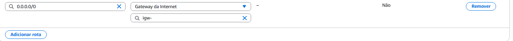
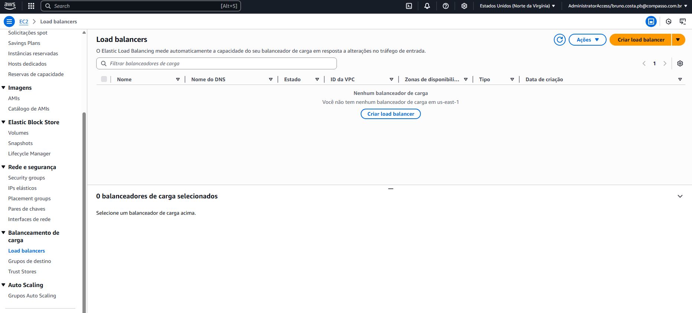

# Wordpress na AWS  

## Este projeto envolve a implantação de uma aplicação WordPress na AWS usando Docker, seguindo uma arquitetura específica.

### Visão Geral do Projeto:

### * A arquitetura inclui:

* Usuários acessando a aplicação através de um Load Balancer.

* Uma Virtual Private Cloud (VPC) abrangendo os recursos.
* Duas Zonas de Disponibilidade, cada uma contendo uma instância EC2 executando WordPress com contêineres Docker.
* Um Auto Scaling Group para gerenciar as instâncias EC2.
* Um banco de dados Amazon RDS (MySQL) para a aplicação WordPress.

### * Principais Tarefas e Requisitos:

* Instalação do Docker/Containerd: Instalar e configurar o Docker ou Containerd no host EC2.

* Implantação do WordPress: Implantar uma aplicação WordPress com:
    * Contêiner de aplicação.
    * Banco de dados RDS MySQL.
* Configuração do AWS EFS: Configurar o AWS Elastic File System (EFS) para arquivos estáticos do WordPress.
* Configuração do Load Balancer: Configurar um Load Balancer AWS para a aplicação WordPress.

### Considerações Importantes:

* Sem IP Público para Serviços WP: Evitar o uso de IP público para os serviços WordPress. O tráfego deve sair idealmente pelo Load Balancer (o Classic Load Balancer é sugerido).

* EFS para Arquivos Estáticos: Utilizar EFS para pastas públicas e estáticas do WordPress.
* Método de Dockerização: Você pode escolher usar Dockerfile ou Docker Compose.
* Demonstração: A aplicação WordPress deve ser demonstrada funcionando (tela de login).
* Porta: A aplicação WordPress precisa estar rodando na porta 80 ou 8080.
* Controle de Versão: Usar um repositório Git para versionamento.

## Primeiros passos :
A Primeira coisa foi criar a estrutura de arquivos em um ambiente local.

### 1. Criando um Dockerfile 

Este ``Dockerfile`` será responsável por criar uma imagem otimizada para o Wordpress.
```Dockerfile
    FROM wordpress:6.5.2-php8.2-fpm-alpine as builder

    FROM wordpress:6.5.2-php8.2-fpm-alpine

    COPY --from=builder /usr/src/wordpress /usr/src/wordpress
    COPY --from=builder /var/www/html /var/www/html

    RUN chown -R www-data:www-data /var/www/html

    EXPOSE 9000

    CMD ["php-fpm"]
```

* ``FROM wordpress:6.5.2-php8.2-fpm-alpine as builder`` : Esse é o ``Build Stage`` , ele usa uma imagem PHP_FPM para o build.

* ``FROM wordpress:6.5.2-php8.2-fpm-alpine`` : Esse é o segundo estágio, chamado de ``Production Stage`` , e utiliza uma imagem de runtime mais leve.

* ``COPY --from=builder /usr/src/wordpress /usr/src/wordpress`` e ``
    COPY --from=builder /var/www/html /var/www/html`` : Esse comando copia os arquivos do WordPress do ``estágio de build`` .

* ``RUN chown -R www-data:www-data /var/www/html`` : Esse comando define permissões apropriadas.

* ``EXPOSE 9000`` : Aqui expomos a porta 9000 que é a porta que o ``PHP-FPM`` usa.


* ``CMD ["php-fpm"]`` : Comando padrão para iniciar o ``PHP-FPM``


### 2. Criando um Docker Compose

Este ``docker-compose.yml`` vai definir como o container WordPress será executado e como ele vai se conectar ao ``RDS`` e o ``EFS`` .

```YAML
version: '3.8'

services:
  wordpress:
    build: .  
    restart: always 
    ports:
      - "80:80" 

    environment:
      WORDPRESS_DB_HOST: ${RDS_HOSTNAME}:${RDS_PORT}
      WORDPRESS_DB_USER: ${RDS_USERNAME}
      WORDPRESS_DB_PASSWORD: ${RDS_PASSWORD}
      WORDPRESS_DB_NAME: ${RDS_DATABASE_NAME}
    volumes:
        - /mnt/efs/wordpress/wp-content:/var/www/html/wp-content      
```

* ``build`` : Constroi a imagem usando o ``Dockerfile`` no diretório atual.
* ``restart: always`` : Reinicia o container caso ele pare.
* ``enviroment:`` : São variáveis de ambiente para conexão com o ``Amazon RDS`` .
* ``volumes:`` : Monta o diretório de uploads e outros conteúdos do ``WordPress`` no ``EFS``

O Banco de dados ``não`` foi definido aqui, porque estarei usando o ``Amazon RDS``. E não é necessario definir volumes na seção ``volumes:`` pos o ``EFS`` será montado diretamente no sistema de arquivos do ``EC2`` . 

### 3. Criando o Script user_data.sh

Este script foi criado para ser executado na inicialização de cada instância ``EC2`` provisionada pelo ``Auto Scaling Group``, ela vai instalar o ``Docker`` ,  ``Docker Compose`` , ``NFS utilities``  e vai montar o ``EFS`` .

```bash
#!/bin/bash
sudo yum update -y
sudo yum install -y docker git nfs-utils

sudo service docker start
sudo systemctl enable docker

sudo usermod -a -G docker ec2-user

sudo curl -L "https://github.com/docker/compose/releases/latest/download/docker-compose-$(uname -s)-$(uname -m)" -o /usr/local/bin/docker-compose
sudo chmod +x /usr/local/bin/docker-compose

# Substitua [EFS_FILE_SYSTEM_ID] pelo ID do seu sistema de arquivos EFS
# Substitua [AWS_REGION] pela região da sua AWS (ex: us-east-1, sa-east-1)
EFS_ID="[EFS_FILE_SYSTEM_ID]"
REGION="[AWS_REGION]"
EFS_MOUNT_POINT="/mnt/efs"
WORDPRESS_EFS_DIR="/mnt/efs/wordpress/wp-content" 

echo "${EFS_ID}.efs.${REGION}.amazonaws.com:/ ${EFS_MOUNT_POINT} nfs4 defaults,_netdev 0 0" | sudo tee -a /etc/fstab
sudo mkdir -p ${WORDPRESS_EFS_DIR}
sudo mount -a -t nfs4


if mountpoint -q "${EFS_MOUNT_POINT}"; then
  echo "EFS montado com sucesso em ${EFS_MOUNT_POINT}."
  sudo mkdir -p ${WORDPRESS_EFS_DIR}
  sudo chown -R ec2-user:docker ${EFS_MOUNT_POINT} 
  sudo chmod -R 775 ${EFS_MOUNT_POINT} 
  sudo chmod g+s ${EFS_MOUNT_POINT} 

  export RDS_HOSTNAME="[SEU_RDS_HOSTNAME]"
  export RDS_PORT="3306"
  export RDS_USERNAME="[SEU_RDS_USERNAME]"
  export RDS_PASSWORD="[SEU_RDS_PASSWORD]"
  export RDS_DATABASE_NAME="[SEU_RDS_DATABASE_NAME]"

  # Clona o repositório Git com seu Dockerfile e docker-compose.yml
  # ATENÇÃO: Substitua [SEU_REPOSITORIO_GIT] pelo link do seu repositório Git
  git clone [SEU_REPOSITORIO_GIT] /home/ec2-user/wordpress-app
  cd /home/ec2-user/wordpress-app

  /usr/local/bin/docker-compose up -d --build

  echo "WordPress implantado com sucesso!"
else
  echo "Erro: EFS não montado. Verifique o ID do EFS e a região."
fi
```

## Configurando a AWS :

### 1. Criando uma VPC

* Fui até ``VPC`` > ``Your VPCs`` > ``Criar VPC`` 

  
  

* Usei as seguintes configurações na tela seguinte:

  
    
    * Optei por um bloco ``CIDR maior``, como o ``/16`` , pelo fato de ele fornecer 65.536 endereços de IP, já que vou usar uma arquitetura de ``2 AZs`` e sub-redes ``públicas`` e ``privadas``.

### 2. Criando sub-redes para a VPC

* Primeiro passo foi ir até a barra lateral das opções e clicar em ``Sub-redes`` :

  

* Em seguida o passo foi Criar as 4 subredes(duas públicas e duas privada, em diferentes ``Zonas de disponibilidade`` ).

  

    * sub-redes criadas:

      
      

### 3. Criando um Internet Gateway, configurando as Tabelas de Roteamento e implantando o NAT Gateway

Aqui foi o passo de configurar o acesso a internet e o roteamento de tráfego, além de tambem criar um ``NAT Gateway`` para as instancias ``EC2`` nas sub-redes privadas poderem se comunicar com o ``mundo externo`` (baixar pacotes, interagir com serviços ``AWS`` e buscar imagens Docker).

* Primeiro passo aqui foi clicar na barra lateral na opção ``Gateways de internet`` :
 

 * Em seguida , clicar na opção ``Criar gateway da Internet`` :

    

  * Gateway criada, ela estava com o status como ``Detached`` :

    

  * Daí foi clicar no menu ``Ações`` e em seguida em ``Associar a uma VPC`` :

    

  E então associar a minha VPC criada .

  
  * O segundo passo foi criar a ``Tabela de Roteamento Pública`` na opção ``Tabelas de rotas`` : 

    
    
    
  Com a tabela criada e associada  à ``VPC`` é só selecionar a tabela criada e ir em ``Rotas > Editar Rotas`` : 

  

  Após isso adicionei uma rota com destino ``0.0.0.0/0`` (o que significa "todo o tráfego da internet"), e como alvo selecionei ``Gateway da Internet`` e abaixo selecionei minha ``VPC`` : 

  

  Em seguida fui até a aba ``Associações de sub-rede`` e associei essa tabela as minha sub-redes públicas :

  

Após isso criei uma tabela de roteamento privada e associei as sub-redes privadas, porem sem a rota de acesso a internet( A idea da comunicação aqui é através do ``NAT gateway``).


Após isso foi ir até ``IPs Elásticos`` para configurar o ``NAT Gateway`` :


Depois cliquei em ``Alocar endereço Ip elástico`` , aloquei meu ip e anotei o ``ID da alocação`` . 

Em seguida fui até ``Gateways NAT`` na barra lateral e cliquei em ``Criar Gateway NAT``:


Na tela de criação eu dei ``nome`` ao gateway, tabém associei ele a ``UMA`` das minhas ``redes públicas`` , pois ele precisa de um IP público pra funcionar e por fim escolhi a ID do ``IP elástico`` que criei previamente :


Com o status como ``Available``, voltei para a opção ``Tabelas de Rotas`` no menu a esquerda e selecionei minha ``rota privada de VPC`` e cliquei em ``Editar rotas``, depois em ``Adicionar rotas`` e coloquei novamente o destino ``0.0.0.0/0`` mas com o target do meu ``NAT Gateway``.

  

Com isso as instâncias ``EC2`` nas sub-redes privadas poderão acessar a internet para baixar dependências, conctar ao ``EFS`` e ``RDS`` de uma forma segura, sem que estejam diretamente acessíveis da internet.

### 4. Criando os Security Groups

Na área de ``EC2`` eu fui até ``Security groups`` e cliquei em ``Criar grupo de segurança`` para criar os grupos de segurança.

Foram criados dessa forma:

* ``SG do Load Balancer`` (``lb-sg``):
  Inbound: HTTP (80) de 0.0.0.0/0 (qualquer lugar).
  Outbound: All traffic para 0.0.0.0/0.

* ``SG das Instâncias EC2`` (``ec2-sg``):
  Inbound: HTTP (80 ou 8080) do lb-sg (o SG do Load Balancer).
  Inbound: SSH (22) do meu IP público (para administração).
  Outbound: All traffic para 0.0.0.0/0 (para que as instâncias possam baixar o Docker, etc.).
* ``SG do RDS`` (``rds-sg``):
  Inbound: MySQL/Aurora (3306) do ec2-sg (o SG das instâncias EC2).
  Outbound: None.
* ``SG do EFS`` (``efs-sg``):
  Inbound: NFS (2049) do ec2-sg (o SG das instâncias EC2).
  Outbound: None.


### 5. Criando a instância AMAZON RDS(MySQL)

Aqui o primeiro caminho foi ir para ``AURORA AND RDS`` e clicar na barra lateral em ``Grupos de subredes`` e criar um grupo de sub-redes para as redes privadas em seguinda clicar em ``Bancos de Dados``, e em seguida clicar em ``Criar banco de dados`` .


Após isso eu defini um ``nome de usuário mestre`` e ``senha``, em ``Conectividade`` eu selecionei a minha ``VPC``, em grupos de segurança eu adicionei o grupo criado para o RDS(``rds-sg``), defini o ``grupo de sub-redes privadas`` , criei o banco de dados e anotei o ``Endpoint`` e a ``Porta`` para adicionar ao script.

### 6. Criando o EFS

Aqui o primeiro passo foi procurar por ``EFS`` e clicar na barra lateral em ``Sistemas de arquivos`` e depois em ``Criar sistema de arquivos``:


Nas opções eu:
  * Escolhi minha ``VPC``
  * Em ``Network access``, eu adicionei os mount targets nas sub-redes privadas de ambas as ``AZ's`` usando o ``efs-sg`` .

Após isso eu anotei o ``File System ID`` para adicionar ao script.

### 7. Criando um Launch Template(Modelo de Lançamento)

Aqui o primeiro passo foi pesquisar por ``EC2`` e depois clicar na barra lateral em ``Modelos de execução`` e logo em seguida em ``Criar um modelo de execução``


Lá dentro eu:
  * Coloquei as tags da instancia.
  * Escolhi a ``AMI``(Amazon Linux).
  * Escolhi o tipo de instancia que foi a ``t2.micro``.
  * Criei um Key Pair(para SSH)
  * Colei o Conteúdo do scripr criado dentro de ``Detalhes Avançados``

### 8. Criando o Auto Scaling Group(ASG)

Aqui, novamente em ``EC2`` eu rolei a barra lateral esquerda e cliquei em ``Grupos Auto Scaling`` e logo após em ``Criar grupo do Auto Scaling`` .


* Aqui eu dei um nome para o ``ASG`` e selecionei meu ``Modelo de execução``, logo após na parte de ``REDE`` eu selecionei a minha ``VPC`` criada e as ``sub-redes privadas`` que eu criei em ambas as ``AZ's``. E por fim defini a capacidade desejada ``1`` , ficando como capacidade desejada: ``1`` e capacidade máxima ``2`` .

### 9. Criando um Application Load Balancer(ALB)

* Primeiro passo aqui foi ainda no ``EC2`` navegar na aba lateral até ``Load Balancers`` e clicando em ``Criar Load Balancer``.



* Na tela seguinte selecionei a opçao ``Application Load Balancer`` .


* Na tela seguinte usei a opçao ``Voltado para internet`` (internet-facing).
  * Escolhi a minha ``VPC``.
  * Mapiei as ``sub-redes públicas`` em ambas as ``AZ's``
  * Na parte de ``Listeners e roteamento`` eu cliquei na opção ``Criar grupo de destino`` e lá usei essas configurações:
    
  * Após isso eu associei ela a minha ``Instancia`` e configurei o ``Listener`` na porta ``80`` para o ``Target Group`` criado.

## Implantação e testes:

* O primeiro passo aqui, foi derrubar as duas instancias pra ver se o Auto Scaling estava funcionando corretamente:


Tudo certo aqui

* O próximo passo foi lançar uma instância como ``Bastion Host`` e verificar se estava tudo certo dentro das instancias com comandos:
```Bash
tail -f /var/log/cloud-init-output.log
```

Que me retornou isso aqui:

```Bash
wordpress-app-wordpress  Built
 Network wordpress-app_default  Creating
 Network wordpress-app_default  Created
 Container wordpress-app-wordpress-1  Creating
 Container wordpress-app-wordpress-1  Created
 Container wordpress-app-wordpress-1  Starting
 Container wordpress-app-wordpress-1  Started
WordPress implantado com sucesso!
Cloud-init v. 22.2.2 finished at Fri, 06 Jun 2025 17:26:43 +0000. Datasource DataSourceEc2.  Up 89.32 seconds
```

Que quer dizer que estava tudo correto com a instalação do ``WordPress``.

E também o comando:

```Bash
sudo docker ps
```

Que me retornou dizendo que estava rodando o WordPress


